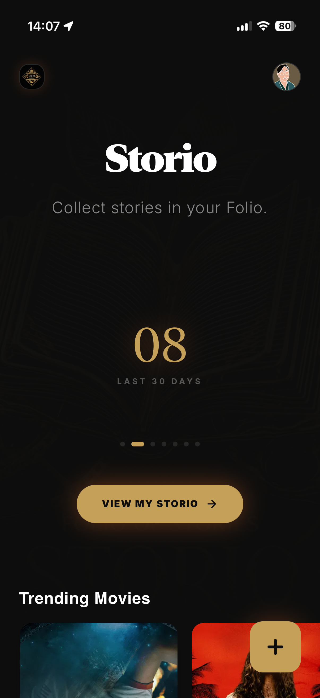
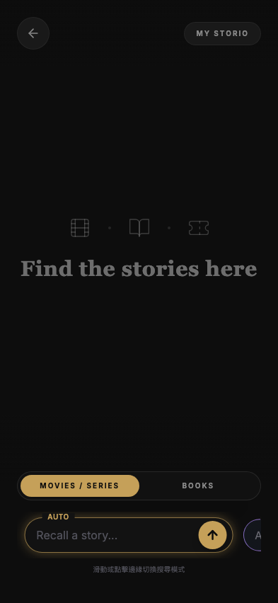
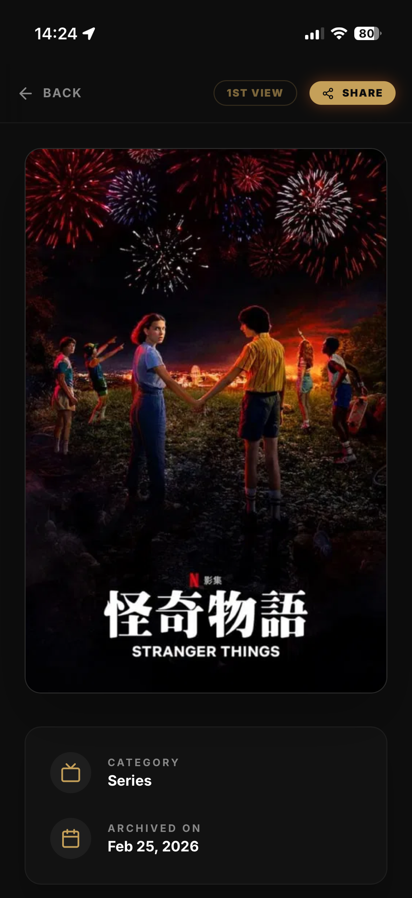
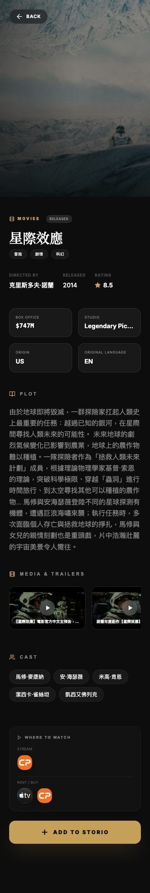
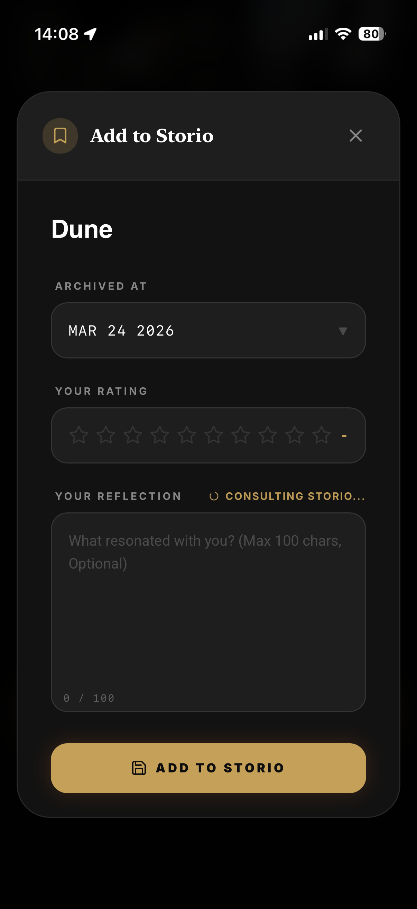
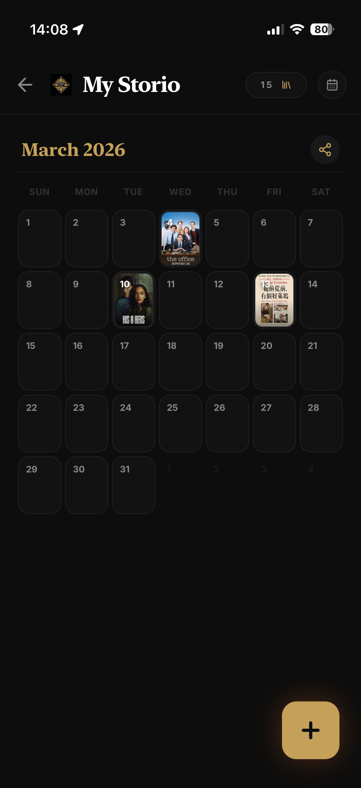
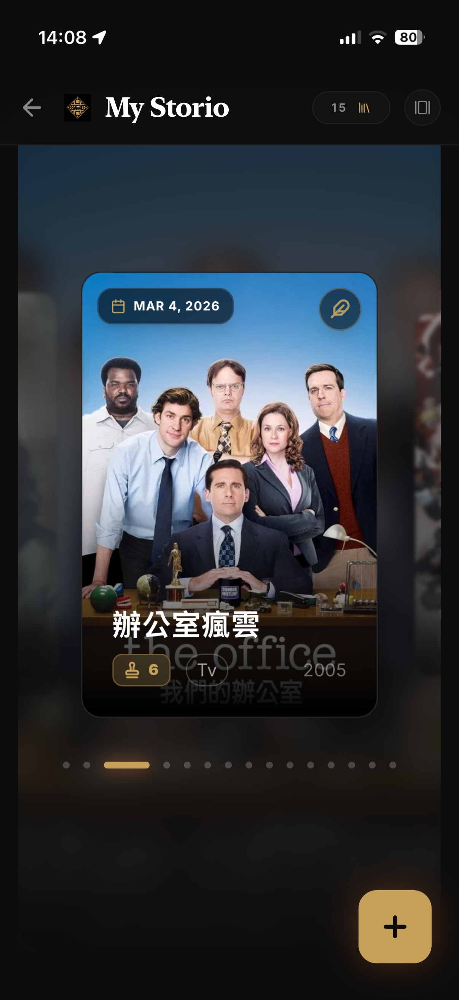
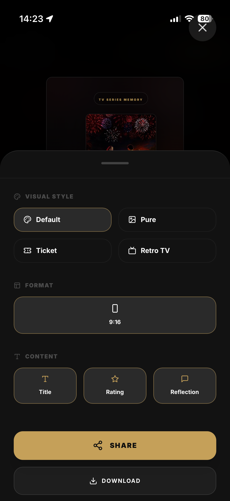
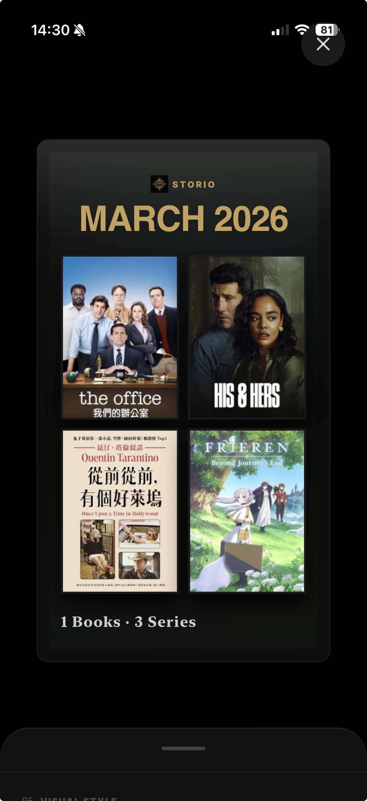
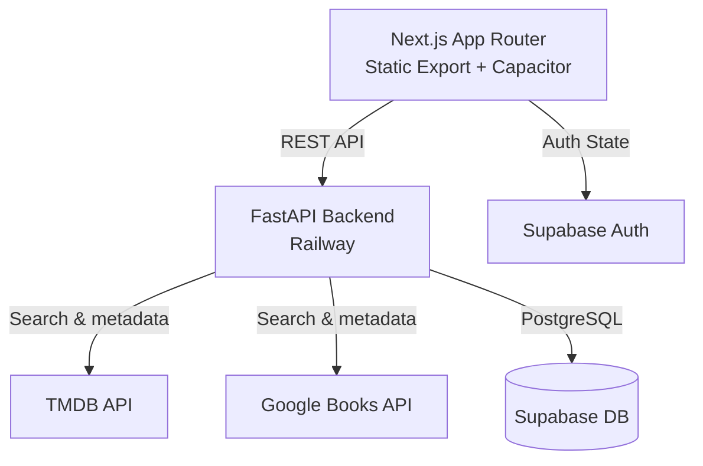

# Storio — Collect stories in your folio

> One place to track every book you read, every film you watch, and every series you finish.


**[Live →](https://storio.andismtu.com)** &nbsp;·&nbsp; iOS TestFlight coming soon

---

## Why I Built This

My wife wanted to keep a record of every book and film she experienced each year. Something she could look back on, and share. But she couldn't find anything that handled both books and screen media in one place.

So I started building Storio around Chinese New Year 2026. I had no coding experience. I put in about 4 to 10 hours a week while working a full-time PM job. Three months later, it's live.

---

## The Problem

People track movies on Letterboxd, books on Goodreads or Bookmory. That means multiple apps, multiple logins, and multiple places to remember something that should feel personal and simple.

Storio puts everything in one place. The goal is not to build another database. It is to give you a private folio where each entry feels like a memory.

---

## Screenshots

<table>
  <tr>
    <td align="center"><br/><sub>Home</sub></td>
    <td align="center"><br/><sub>Search</sub></td>
    <td align="center"><br/><sub>Story Details</sub></td>
  </tr>
  <tr>
    <td align="center"><br/><sub>Cast & Streaming</sub></td>
    <td align="center"><br/><sub>Add & Reflect</sub></td>
    <td align="center"><br/><sub>Calendar View</sub></td>
  </tr>
  <tr>
    <td align="center"><br/><sub>Gallery</sub></td>
    <td align="center"><br/><sub>Share Card</sub></td>
    <td align="center"><br/><sub>Monthly Recap</sub></td>
  </tr>
</table>

---

## Key Product Decisions

**1. Dark, cinematic UI**

No white backgrounds or long lists. Storio uses a dark theme (`#0d0d0d`) with Storio Gold accents. When you open a story, the artwork fills the screen with a soft blur behind all the metadata.

**2. Multiple watches, multiple memories**

Most apps break when you watch the same film twice. In Storio, watching it again creates a new card on your timeline. You can write different notes and give it a different rating each time.

**3. No sign-up required to start**

You should be able to try the app before giving us your email. Storio uses Supabase Anonymous Auth, so you can add up to 10 stories right away without creating an account.

**4. One clean data format from multiple sources**

Movies come from TMDB. Books come from Google Books. Their data formats are very different. The backend uses an agent pattern to turn all of that into one clean `Story` object that the app can use.

**5. Feels like a native iOS app**

The app is built with Next.js and wrapped in Capacitor. It uses iOS safe-area padding and native share and file plugins so it behaves like a real iOS app, even though the core is web code.

---

## Architecture



---

## Tech Stack

| Layer | Technology | Why |
|---|---|---|
| Frontend | Next.js 14 + Tailwind CSS | Static export for Capacitor. Tailwind makes the custom design system fast to build. |
| Native Wrapper | Capacitor | Wraps the web app as a real iOS app with access to Share Sheet and Filesystem. |
| Backend | FastAPI (Python) | Good fit for agent workflows and calling multiple external APIs. |
| Database & Auth | Supabase (PostgreSQL) | Handles anonymous auth out of the box, which is key for the no-sign-up onboarding. |
| Hosting | Vercel + Railway | Frontend on Vercel. Backend (FastAPI + Puppeteer service) on Railway. |
| Share Image | Puppeteer (Railway microservice) | Server-side headless Chrome screenshots — the only reliable way to render CSS 3D, backdrop-filter, and CJK fonts across all platforms. |
| Automation | n8n | Background data processing. |
| Testing | Playwright (E2E), Pytest | |

---

## How I Built This

I had zero coding experience when I started. Here is what my workflow actually looked like.

### The workflow

**Step 1: Write a spec first**

Every feature started with a written proposal — problem statement, design decisions, and acceptance criteria — before any code was written. I used [OpenSpec](https://github.com/open-spec/openspec) inside Claude Code CLI to turn each proposal into a structured set of specs and tasks. I pushed back on AI outputs, adjusted scope, and made product decisions before touching the implementation.

**Step 2: Keep the AI in context**

LLMs have no memory between sessions. To work around this, I kept a set of living documents in the repo: `StorioWiki.md`, `BACKLOG.md`, `DEV_SETUP.md`, and formal bug reports. At the start of each session, the right documents gave the AI exactly where things stood. For significant bugs, I wrote a formal bug report and saved it so future sessions could pick it up.

**Step 3: Use structured review before shipping**

I used [superpowers](https://github.com/obra/superpowers) and [gstack](https://github.com/garrytan/gstack) to add structure to the AI loop. Every feature went through TDD (tests written before implementation), a QA pass with a headless browser, and a code review step. I updated the backlog and wiki after each session so the next one could start clean.

Primary tools: **Gemini CLI** and **Claude Code CLI**.

### The hardest problem

The share feature looked simple: pull a poster image, turn it into a share card, export as PNG.

It turned out to be the hardest part of the project — and required two complete architectural rewrites.

**Round 1 — client-side canvas (`html-to-image`).** TMDB poster images are hosted on a different domain. When `html-to-image` tried to draw them onto a canvas, the browser blocked the export because of cross-origin restrictions. On iOS and Safari, there were more problems: memory limits caused the image to fail at high resolution, CSS `backdrop-filter` blur disappeared, and `preserve-3d` for the 3D book template was completely flattened. The workarounds (Next.js image proxy, pixel-ratio cap, font preloading) fixed the CORS issue but could not solve the WKWebView rendering limits.

**Round 2 — server-side Puppeteer microservice.** The real fix was moving screenshot generation off the client entirely. I built a separate Node.js service running headless Chrome on Railway. The Next.js frontend has a dedicated `/share/render` page that accepts `window.__RENDER_DATA__` injection, renders the template with full CSS support, and signals `window.__RENDER_READY__ = true` once fonts are loaded. Puppeteer waits for that signal and takes the screenshot server-side — where `preserve-3d`, `backdrop-filter`, and CJK font subsetting all work correctly.

**The CJK font edge case.** Even after the Puppeteer migration, Chinese characters still rendered as □□□□ in some templates. The root cause: headless Chrome's unicode-range font subsetting does not trigger a woff2 download for a text node that has both `text-transform: uppercase` and a `font-family` inherited from a parent element (rather than set directly on the element). The fix was to set `font-serif` or `font-sans` directly on every `uppercase` text element that could contain CJK content.

The key was treating each failure as a diagnostic signal, not a reason to try random fixes.

---

## Getting Started

### Prerequisites

- Node.js (v20+) and `pnpm`
- Python 3.12+
- Xcode and CocoaPods (for iOS)
- A Supabase project
- API keys for TMDB and Google Books

### 1. Backend

```bash
cd server
python3 -m venv venv
source venv/bin/activate
pip install -r requirements.txt
cp .env.example .env
python -m uvicorn app.main:app --reload --port 8010
```

### 2. Frontend

```bash
cd client
pnpm install
cp .env.local.example .env.local
pnpm dev
```

### 3. Puppeteer Service (share image generation)

```bash
cd puppeteer-service
npm install
# Set ALLOWED_ORIGINS=http://localhost:3000 in .env
node src/index.js
```

The service runs on port 3001 by default. Set `NEXT_PUBLIC_PUPPETEER_SERVICE_URL=http://localhost:3001` in `client/.env.local` to connect the frontend.

### 4. iOS

```bash
cd client
pnpm run build
npx cap sync ios
npx cap open ios
```

---

## About

I am a PM transitioning from data to building. Storio is my side project and portfolio piece. I built it part-time over three months with no prior coding experience, using AI tools and a structured workflow.

The point is not that AI wrote the code. The point is that a PM who thinks carefully about problems, keeps good documentation, and uses the right tools can ship a real product on their own.

**[storio.andismtu.com](https://storio.andismtu.com)** &nbsp;·&nbsp; [LinkedIn](https://www.linkedin.com/in/anderson-tu/) &nbsp;·&nbsp; [andismtu.com](https://andismtu.com)
