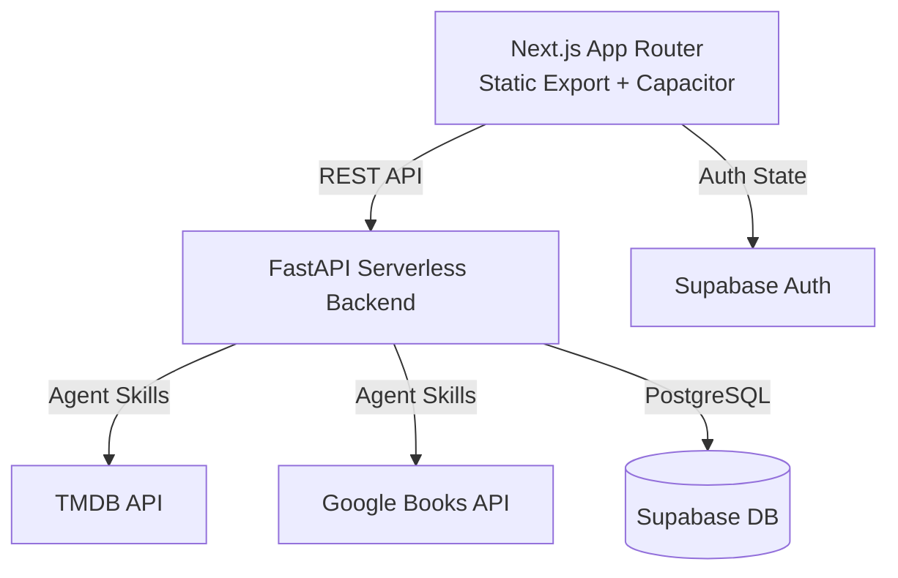

# Storio — Collect stories in your folio

> A quiet, sophisticated digital Pensieve for curating your personal collection of movies, series, and books.


*(Replace the placeholder above with a real screenshot or GIF demonstrating the App's UI, such as the Home Dashboard or the Share Card feature)*

---

## Why I Built This

The modern media landscape is fragmented. We track movies on Letterboxd/IMDb, series on Trakt, and books on Goodreads. This scattered approach turns the deeply personal act of "remembering a great story" into a sterile, data-entry chore across multiple uninspiring platforms. 

I built **Storio** to solve this pain point. It's not designed to be a social network or an encyclopedic database. It is designed as a **digital Pensieve**—a private, beautifully crafted digital folio where the focus is entirely on *your* relationship with the story. It brings books and screen media together under one roof, treating each entry not as a database row, but as a cherished memory.

## Product Decisions

To achieve this vision, several key product and design decisions were made:

1. **Backdrop-First & Cinematic UI**: We abandoned the traditional "white background with lists" approach. Storio uses a completely dark theme (`#0d0d0d`) with "Storio Gold" accents. When viewing a story, the artwork expands to fill the background with a cinematic blur, pulling the user into the mood of the piece.
2. **The "Rewatch/Reread" Philosophy**: Most trackers struggle with items you consume multiple times. In Storio, adding a movie you've already seen doesn't just update a counter; it creates a *new, distinct memory card* on your timeline. This allows you to have different reflections and ratings for the exact same story across different periods of your life.
3. **Frictionless Onboarding (Anonymous First)**: Users shouldn't have to surrender their email just to see if the app is good. Storio utilizes Supabase Anonymous Auth, allowing users to instantly start searching and curating their folio (up to 10 items) the moment they open the app, before ever being asked to sign up.
4. **Agent-Centric Backend**: To handle the disparate data structures of TMDB (movies/TV) and Google Books, the FastAPI backend uses an "Agent" pattern (Curator, Search, Scribe). This abstracts the complexity away from the frontend, delivering unified `Story` objects to the client.
5. **Native iOS Feel via Web Tech**: Built as a Next.js Static Export wrapped in Capacitor, the app implements meticulous CSS safe-area padding and native Share/Filesystem plugins to feel indistinguishable from a Swift app on an iPhone.

## Architecture

Storio is built using a modern, serverless architecture optimized for cross-platform deployment.



## Tech Stack

This project leverages a modern, serverless ecosystem:

- **Frontend: Next.js 14 (React) & Tailwind CSS**
  - *Why*: Chosen for its robust App Router architecture and static export capabilities. Tailwind enables rapid implementation of the bespoke "Folio Black" and "Storio Gold" design system without the overhead of heavy UI libraries.
- **Native Wrapper: Capacitor**
  - *Why*: Allows the Next.js static export to be deployed as a true native iOS application. It provides seamless access to native APIs (like iOS Share Sheet and Filesystem) while maintaining a single web codebase.
- **Backend: FastAPI (Python)**
  - *Why*: Python is the optimal choice for integrating AI/Agent workflows and external API orchestration (TMDB, Google Books). FastAPI provides exceptional performance and automatic OpenAPI documentation.
- **Database & Auth: Supabase (PostgreSQL)**
  - *Why*: Provides a robust, scalable relational database alongside out-of-the-box Anonymous Auth, which is critical for Storio's frictionless guest onboarding strategy.
- **Infrastructure & Automation**:
  - **Vercel**: For hosting the Frontend and Serverless Backend.
  - **Railway**: Used for specific backend or worker deployments (if applicable).
  - **n8n**: For workflow automation and background data processing.
- **Testing**: Playwright (E2E), Pytest

## Getting Started

### Prerequisites
- Node.js (v20+) & `pnpm`
- Python 3.12+
- Xcode & CocoaPods (for iOS deployment)
- A Supabase Project
- API Keys for TMDB and Google Books

### 1. Backend (FastAPI) Setup
```bash
cd server
python3 -m venv venv
source venv/bin/activate
pip install -r requirements.txt

# Copy env template and fill in your keys
cp .env.example .env

# Run the development server
python -m uvicorn app.main:app --reload --port 8010
```

### 2. Frontend (Next.js) Setup
```bash
cd client
pnpm install

# Setup your local environment variables
# Requires NEXT_PUBLIC_SUPABASE_URL and NEXT_PUBLIC_SUPABASE_ANON_KEY
cp .env.local.example .env.local

# Run the web development server (Will auto-detect IP for mobile testing)
pnpm dev
```

### 3. iOS Deployment (Capacitor)
Storio is fully optimized for iOS static export.
```bash
cd client
# Build the static HTML export
pnpm run build

# Sync the web assets to the iOS project
npx cap sync ios

# Open in Xcode to build and run on a Simulator or Device
npx cap open ios
```

---

## About This Project

Storio was built entirely through **pure vibe coding and AI tools**. 

Prior to this project, I had zero coding experience. I am currently transitioning from a **Data PM to a Build PM**. Storio represents an independent endeavor where I drove everything—from initial product definition and UX/UI decisions to the actual full-stack implementation—proving that with modern AI tools, product managers can bring their complete visions to life without being blocked by traditional engineering constraints.