# Sprint 4 需求規格書: 社交身份與資料遷移

**版本**: 1.1 (Zh-TW)
**狀態**: 草稿
**日期**: 2026-02-23

---

## 1. 核心需求概覽

本 Sprint 將重點放在建立真實的用戶身份系統，確保訪客能順利轉化為註冊會員而不遺失資料，並透過社交分享功能推動產品成長。

---

## 2. 需求 A: 身份認證與個人檔案擴充 (Identity & Profile Expansion)

### 2.1 功能規格 (Functional Specs)
**目標**: 透過安全的 Email OTP 或 OAuth 進行認證，並在註冊流程中收集用戶基本人口統計資料，以利未來個性化推薦。

1.  **認證方式**:
    *   **Email OTP (Magic Code)**: 輸入 Email -> 系統發送 6 位數驗證碼 -> 輸入驗證碼 -> 登入。(已完成)
    *   **OAuth (Social Login)**: 整合 Google 與 Apple Sign-in。(Google已完成，Apple Sign-in還沒)
2.  **註冊資料收集 (Profile Completion)**:
    *   **觸發時機**: 新用戶首次完成認證 (Sign Up) 後彈出，或舊用戶資料缺失時補全。**此步驟為可選（Skippable）**。
    *   **選填/可編輯欄位**:
        *   **生日 (Birthday)**: 輸入生日。
        *   **性別 (Gender)**: 選項 (男性, 女性, 非二元性別, 不願透露)。
        *   **名稱與頭像 (Username & Avatar)**: 使用者可自訂名稱並上傳/選擇頭像。
    *   **限制與顯示**: 註冊後，所有資料皆可在 Profile 頁面**隨時進行修改**與調整。Profile 頁面僅顯示生日日期 (MMM-DD-YYYY 格式)，不顯示年齡 (系統可另外於資料庫或其他欄位計算年齡區間)。
3.  **Profile 頁面更新**:
    *   新增 "Curator Profile" 區塊，並提供**編輯模式**，允許使用者上傳頭像、更改名稱、生日及性別。

### 2.2 使用者流程 (User Flow)
```mermaid
graph TD
    A[訪客/新用戶] -->|點擊登入/註冊| B(開啟認證 Modal)
    B --> C{選擇方式}
    C -->|Email| D[輸入 Email -> 接收 OTP]
    C -->|Social| E[Google / Apple OAuth]
    D --> F[驗證成功]
    E --> F
    F --> G{檢查是否為新用戶?}
    G -->|Yes| H[顯示 Profile Completion Modal]
    G -->|No| I[進入 App 首頁]
    H --> J[選擇填寫或跳過(Skip)]
    J --> K[完成註冊]
    K --> I
```

### 2.3 線框圖 (Wireframe) - Profile Completion Modal
```text
+--------------------------------------------------+
|                                                  |
|  歡迎來到 Storio, Curator.                       |
|                                                  |
|  為了建立您的個人典藏檔案，請提供                |
|  以下基本資訊。                                  |
|                                                  |
|  [ 性別 Gender ]                                 |
|  ( ) 男性  ( ) 女性  ( ) 非二元  ( ) 不願透露    |
|                                                  |
|  [ 生日 Birthday ]                               |
|  [ 輸入您的生日 ] (例: MMM-DD-YYYY)              |
|                                                  |
|  * 您可以先跳過，之後隨時在 Profile 頁面修改。   |
|                                                  |
|  [ 完成 Complete ]                    [ Skip ]   |
|                                                  |
+--------------------------------------------------+
```

---

## 3. 需求 B: 訪客資料無縫遷移 (Guest Data Migration)

### 3.1 功能規格 (Functional Specs)
**目標**: 當訪客決定註冊時，其在「訪客模式」下收藏的所有內容 (Folio Items) 必須自動轉移至新帳號。

1.  **觸發機制**:
    *   偵測 `Supabase Auth` 狀態變化：從 `anonymous` (訪客) 轉變為 `authenticated` (已登入)。
2.  **遷移邏輯**:
    *   後端 (Database Function/Trigger) 或前端 Hook 執行：
        *   將 `items` 資料表中的 `user_id` 從舊的 Guest UUID 更新為新的 User UUID。
        *   將 `ratings` 與 `reflections` 資料表中的 `user_id` 同步更新。
    *   **衝突處理**: 若新帳號已存在相同作品 (Item ID)，保留**新帳號**的紀錄，忽略訪客的重複項目 (或依時間戳記保留最新)。

### 3.2 使用者流程 (User Flow)

```mermaid
sequenceDiagram
    participant User
    participant App (Client)
    participant Supabase Auth
    participant Database

    Note over User, App: 使用者處於訪客模式 (擁有 5 個收藏)
    
    User->>App: 點擊 "Sign Up to Save"
    App->>User: 顯示認證 Modal
    User->>App: 完成 Email OTP 驗證
    App->>Supabase Auth: verifyOtp(token)
    Supabase Auth-->>App: 返回 Session (新 User ID)
    
    rect rgb(20, 20, 20)
        Note right of App: 關鍵遷移步驟
        App->>App: 偵測到登入狀態變更
        App->>Database: RPC 呼叫 `migrate_guest_data(guest_id, new_id)`
        Database-->>App: 成功 (5 個項目已轉移)
    end
    
    App->>User: 顯示 Profile Completion (若為新用戶)
    App->>User: 導向至館藏頁面 (所有項目皆保留)
```


---
