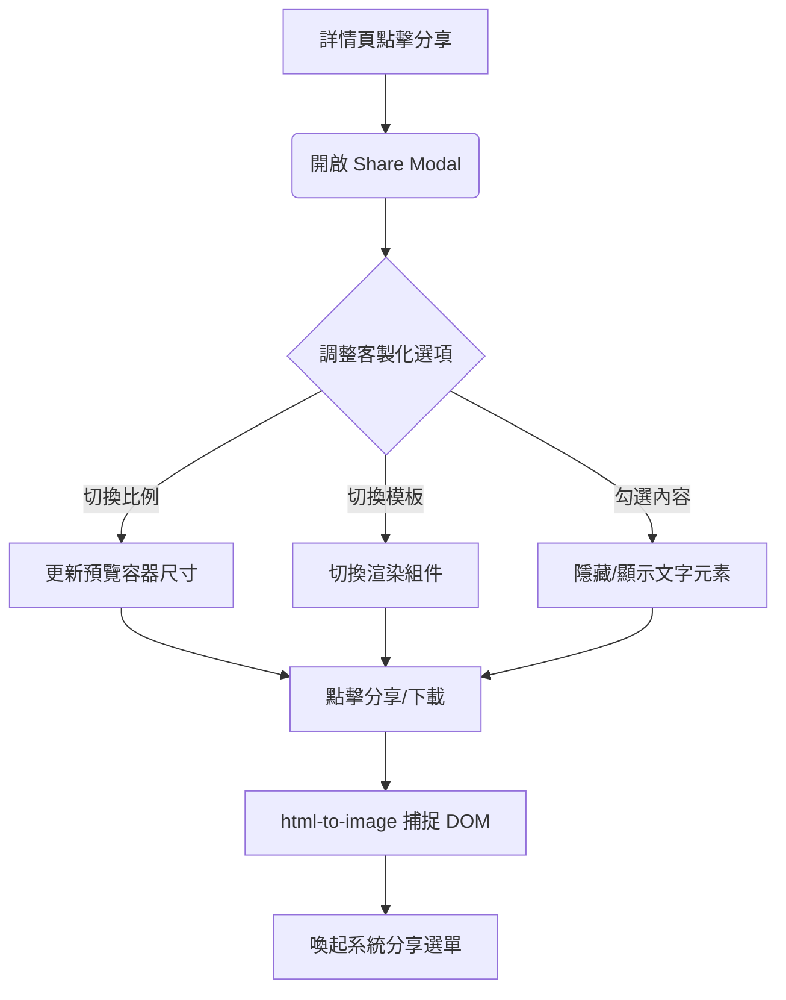

# Sprint 5 需求規格書: Memory Card 深度客製化分享

**版本**: 1.1 (Zh-TW)
**狀態**: 進行中
**日期**: 2026-02-23

---

## 1. 核心需求概覽

本 Sprint 專注於 **Memory Card (單一作品分享)** 的極致化體驗。目標是讓每一位策展人都能將自己的收藏，轉化為風格各異、極具質感的數位藝術品，分享至社交平台。

*   **註**: 月度回顧 (Monthly Recap) 已移至 Sprint 6。

---

## 2. 需求 C: Memory Card 社交分享功能

### 2.1 功能規格 (Functional Specs)

1.  **分享控制中心 (Share Control Modal)**:
    *   **即時預覽**: 所有的調整（比例、模板、開關）需立即反映在預覽區域。
    *   **比例切換 (Aspect Ratio)**:
        *   `9:16`: Instagram Story / 手機桌布。
        *   `4:5`: Instagram Feed / 質感貼文。
        *   `1:1`: 經典正方形。
    *   **內容開關 (Content Toggles)**:
        *   顯示/隱藏標題 (Title)。
        *   顯示/隱藏評分 (Rating)。
        *   顯示/隱藏心得 (Reflection)。
    *   **分享機制**:
        *   優先使用 Web Share API 呼叫系統分享。
        *   備援提供「下載圖片」與「複製圖片」。

2.  **主視覺模板 (Visual Templates)**:
    *   **[通用] Default Blur**: 高斯模糊海報背景 + 懸浮卡片感。
    *   **[通用] Pure Image**: 僅保留原始海報，適合極簡主義者。
    *   **[影視專屬] Cinema Ticket**: 
        *   設計成復古電影票根。
        *   邊緣帶有打孔虛線感。
        *   包含作品資訊、評分與專屬 QR Code 條碼。
    *   **[書籍專屬] 3D Paperback**:
        *   將封面渲染為立體書本。
        *   **書背厚度**: 依據 `pages` 屬性動態調整 (頁數越多書越厚)。
        *   搭配簡約背景。

### 2.2 使用者流程 (User Flow)


### 2.3 線框圖 (Wireframe)
```text
+--------------------------------------------------+
|  [X] Close                                       |
|                                                  |
|  +--------------------------------------------+  |
|  |             (Live Preview Area)            |  |
|  |                                            |  |
|  |       [ Dynamic Template Rendering ]       |  |
|  |                                            |  |
|  +--------------------------------------------+  |
|                                                  |
|  [ 模板: 預設 | 純海報 | 票根 | 3D立體書 ]       |
|  [ 比例: 9:16 | 4:5 | 1:1 ]                      |
|                                                  |
|  顯示內容: [v] 標題  [v] 評分  [v] 心得          |
|                                                  |
|  [         一鍵分享 (Share Memory)           ]   |
+--------------------------------------------------+
```